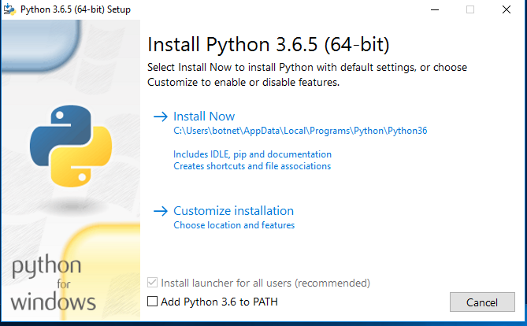

	
# Robolid2018  
## Guia de instalación de python y librerías necesarias para el curso 
 
### 1. Instalación de python 
 
En caso de que estes usando Linux o Mac, python debería estar instalado por defecto y puedes omitir este paso. Para estar seguros, escribe ```python --version``` en una terminal para ver la versión de python instalada en tu sistema. Si dicha es versión es 2.7, prueba con el comando ```python3 --version```. Si se muestra una versión 3.x.x, reemplaza `python` en todos los comandos mostrados en esta guia por `python3`. 
 
En caso de que estes usando Windows, [haz click en este enlace](https://www.python.org/ftp/python/3.6.5/python-3.6.5-amd64.exe) para descargar la ultima versión del instalador de Python para windows en el momento en el que se impartió este curso (Python 3.6.5). Una vez descargado el instalador, ejecutalo y la siguiente ventana debería aparecer. 
 
 
  
 Asegurate de marcar la casilla *Add Python 3.6 to PATH* para que puedas ejecutar python desde una terminal sin tener que modificar ningún archivo del sistema adicional. Tras esto, haz click en *Install Now*. 
 
 ### 2. Instalación de librerías 
 
 Las librerías necesarias para el curso son pyserial, peewee y flask. Si sabes usar VirtualEnvs, dispones de virtualenvs preparados con las librerías necesarias en cada branch del repositorio. En caso contrario, para instalar las librerías necesarias en el sistema, abre una terminal. 
 
 Primero asegurate de que pip, el gestor de librerías de python, esta actualizado a la ultima versión ejecutando el siguiente comando: 
 
 ```python -m pip install --upgrade pip``` 
 
 Una vez actualizado pip, el siguiente comando instalara las librerías y sus dependencias. 
 
 ```pip install peewee pyserial flask``` 
 